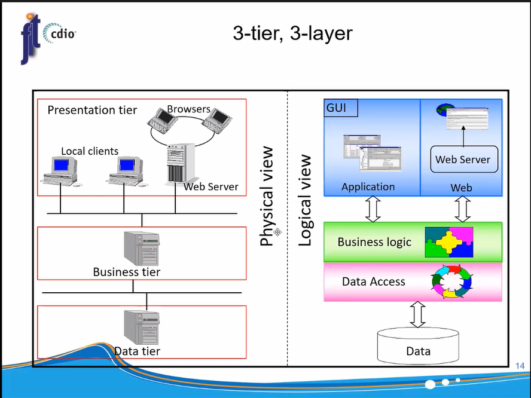

# ToDoListApp

Welcome to the ToDoListApp project! This project showcases a fully functional ToDo list application with a 3-tier-3-layer architecture. The app includes an Android front-end developed in Java using Android Studio, and a back-end developed with Spring Boot. The data is stored in a MySQL database, and APIs are called using Jackson and OkHttp3 libraries.

## Demo

https://youtu.be/atKfeebnaLw

## Project Description

The ToDoListApp allows users to create and manage their tasks effectively. The app follows a 3-tier-3-layer architecture, where the Android app serves as the presentation layer (UI), the back-end handles business logic and API interactions, and the MySQL database stores the task data.

## Architecture

## Technologies Used

- Android Studio: The front-end of the ToDoListApp was developed in Java using Android Studio.
- Spring boot: The back-end of the app was developed using Spring boot to handle business logic and API endpoints.
- MySQL: The MySQL database was used to store user and task data.
- Jackson and OkHttp3: Jackson library was used for JSON serialization and deserialization, while OkHttp3 was used for making API calls.

## Getting Started

To run the ToDoListApp locally, follow these steps:

1. Clone the repository: `git clone https://github.com/lmtri2307/TodoListApp`
2. Set up the back-end:
   - Navigate to the `server` directory
   - Config the `database.username` and `database.password` in the `application.yml` file
   - Run the back-end server: `yarn start`
3. Set up the front-end:
   - Open the Android project in Android Studio located in the `client` directory.
   - Build and run the project on an emulator or physical device.

## Usage

Once the ToDoListApp is running, users can create an account, manage tasks, and create to-do lists through the user-friendly Android interface. API calls are made to the back-end for seamless data management.

## Contributing

Contributions to the ToDoListApp project are welcome! If you would like to contribute, please fork the repository, make your changes, and submit a pull request.
